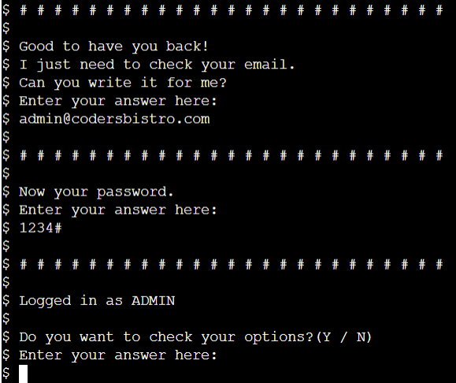

# Coder's Bistro

Coder's Bistro is a restaurant app that has two different main functions:

Customer's function that displays the menu, collect the order and generate an invoice for the customer. Admin's function that give to the user the option to check the sales, check and create a new expense and ckeck the total.

https://coders-bistro.herokuapp.com/

## Author

Arthur Henrique El Mezaonik Martins

## Table of Contents

- [Coder's Bistro](#coder-s-bistro)

  * [Author](#author)

  * [Table of Contents](#table-of-contents)

  * [How to Use](#how-to-use)

  * [Features](#features)

    + [Implemented Features](#implemented-features)

      - [Customer](#customer)

      - [Admin](#admin)

      - [Invalid input messages](#invalid-input-messages)

    + [Future Features](#future-features)

  * [Design Documents](#design-documents)

  * [Data Model](#data-model)

  * [Libraries Used](#libraries-used)

  * [Testing](#testing)

    + [Validation Testing](#validation-testing)

    + [Manual Testing](#manual-testing)

    + [Bugs](#bugs)

    + [Unifxed Bugs](#unifxed-bugs)

  * [Deployment](#deployment)

    + [Creating App.](#creating-app)

    + [Setting up Heroku App](#setting-up-heroku-app)

    + [App Deployment](#app-deployment)

  * [Credits](#credits)

    + [Acknowledgments](#acknowledgments)

<small><i><a href='http://ecotrust-canada.github.io/markdown-toc/'>Table of contents generated with markdown-toc</a></i></small>

## How to Use

The first thing you need to do when using this app is choosing if you want to log in or create a new account.

*__Customer:__*

If you choose to log in, then you will need to pass your registered email. But if you choose to create an account, you’ll need to pass your first and last name and an email address to be registered.

After that, you will be able to choose between three different menus, and then the item that you want to order. You need to pass the quantity for each item that you choose.

When that is done and you don’t want to order anything else, an invoice will be displayed and the system is going to end.

* Customer function vídeo

    

* Create account vídeo

    

*__Admin:__*

If you choose to log in and pass the admin’s email (admin@codersbistro.com), the app will request you the admin’s password (1234#).

The admin has four options, check sales, update and check expenses and check the total.

If you choose to check your sales, expenses, or total, the app is going to request the date that you want to check, collect the data from the worksheet and display back to you. If you choose to update expenses, you’ll need to pass the value of the new expense and a brief description, and then the app is going to pass these values into the worksheet.

* Admin function vídeo

    

*__Worksheet interation__*

* Customer with worksheet vídeo

    

* Admin with worksheet vídeo

    

## Features

### Implemented Features

#### Customer

* Log in and create an account

    

    - Display a basic welcome message

    - Display a question asking if you want to log in or create a new account

* Log in (collect email)

    

    - Collect the user's email address

    - Validate the email address

* Create an account

    

    - Ask for user's first and last name

    - Ask and validate email address

    - Check if email is not already in use

    - Send the new data  for the client's worksheet

* Display menu

    

    - Ask to the customer wich menu does he want to check

    - Validate if the otpion is in the menu list

    - Collect the menu from the worksheet and displays to the customer

    

* Collect customer order

    

    - Ask for the customer which item does he/she want to buy.

    - Validate the option

    - Ask for the customer how many of these item does he/she wants.

* Display the Invoice

    

    - When the customer finish to order, the app displays an invoice with all the ordered items

    - The app add the sale to the sales worksheet

#### Admin

* Email and Password

    

    - If the user enter the admin’s email (admin@codersbistro.com) the app will request the admin’s password.

* Admin’s options

    

    - When admin’s email and password are validated, the app displays the admin’s options

    - Option A, C and D

        - Those three options collect the date that the admin wants to check

        - The date is validated for the right format

        - And then collect the data from the worksheet and displays on the screen

        __Option A image__

        

        __Option C image__

        

        __Option D image__

        

    - Option B

        - First thing, the app requests a value that you want to create the new expense

        - Validate the value

        - Then the app requests a brief description about the expense

        - To finish, the app sends the collected data for the expense’s worksheet

        __Option B image__

        

#### Invalid input messages

* The app displays some different messages for different invalid inputs.

    - Invalid Email
        
        

    - Email not found

        

    - Incorrect date format
        
        

    - Incorrect value format
        
        

### Future Features

* For future features, we hope to implement a way that we can create and edit admin’s details as email and password.

* We also want to implement a way that the customer can receive a copy of the order by email

## Design Documents

* Flowchart

    

## Data Model

## Libraries Used

* cachetools

    - Extensible memoizing collections and decorators

* dnspython

    - It is a DNS toolkit for Python. It supports almost all record types. It can be used for queries, zone transfers, and dynamic updates. It supports TSIG authenticated messages and EDNS0.

* email-validator

    - This library validates that a string is of the form name@example.com.

* google-auth

     - This library simplifies using Google’s various server-to-server authentication mechanisms to access Google APIs.

* google-auth-oauthlib

    - This library provides oauthlib integration with google-auth.

* gspread

     - Interface for working with Google Sheets.

* oauthlib

    - A generic, spec-compliant, thorough implementation of the OAuth request-signing logic for Python 3.6+.

* pyasn1

    - Pure-Python implementation of ASN.1 types and DER/BER/CER codecs (X.208)

* pyasn1-modules

    - A collection of ASN.1 modules expressed in form of pyasn1 classes. Includes protocols PDUs definition (SNMP, LDAP etc.) and various data structures (X.509, PKCS etc.).

* requests-oauthlib

    - Provides first-class OAuth library support for Requests.

* rsa

    - It supports encryption and decryption, signing and verifying signatures, and key generation according to PKCS#1 version 1.5.

## Testing

### Validation Testing

* PEP 8
        
    - No errors found

### Manual Testing

[Manual Test Worksheet](https://docs.google.com/spreadsheets/d/1A5n-yFCNHejG8mGdeF9jzbcHgz7moduIHwa9voJg6mw/edit?usp=sharing)

### Bugs

* When I wrote the admin’s check_expenses function I was getting XXX when tried to transform the string into a float. The reason for that is because when the app collects the value from the worksheet it was coming with (“,” symbol (ex:12,50) and python use “.” Symbol. I fixed that using the replace method to change the “,” for a “.” symbol.

### Unifxed Bugs

* No bugs remaining

## Deployment

This application will be deployed via [Heroku](https://heroku.com)

### Creating App.

1. Ensure all code is correct and ready for deployment.

2. Enter the following code to import the required dependencies to the requirements.txt file:
    > pip3 freeze > requirements.txt

    - Heroku will use this file to import the dependencies that are required.

3. Log into or sign up to Heroku(it's free).

    - If signing up, you will need to wait and accept an authentication email.

4. Navigate to Dashboard. 

5. Click "New" and select "create new app" from the drop-down menu. This is found in the upper right portion of the window.

6. Provide a name for your application, this needs to be unique, and select your region.

7. Click "Create App".

### Setting up Heroku App

1.	Navigate to "Settings" and scroll down to "config vars".

    - That’s where you would store sensitive data that needs to kept secret. On my case my file creds.json to access the Google Sheet.

    - creds.json example:

        

2. Click "Reveal Config Var", in the field key I entered the CREDS word and in the value field I copied my creds.json content as past there.

3. Then scroll down to "build packs".

2. Click "build packs" and then click both "python" and "node.js"(node.js is needed for the mock terminal.)

    - Ensure that the python buildpack is above the node.js buildpack, You can click and drag the packs to re-arrange them.

### App Deployment

1. Navigate to the "Deploy" section.

2. Scroll down to "Deployment Method" and select "GitHub".

3. Authorize the connection of Heroku to GitHub.

4. Search for your GitHub repository name, and select the correct repository.

5. For Deployment there are two options, Automatic Deployments or Manual.

    - Automatic Deployment: This will prompt Heroku to re-build your app each time you push your code to GitHub.

    - Manual Deployment: This will only prompt Heroku to build your app when you manually tell it to do so.

6. Ensure the correct branch is selected "master/Main", and select the deployment method that you desire. In this case, I will be using Automatic Deployment

## Credits

### Acknowledgments

* Code Institute: Love Sandwiches Project
    
    - Deployment terminal

    - Function update_worksheet

    - Steps to declare and connect the API to my worksheet

* Escape the Cave program by Ruairidh MacArthur

    - Used deployment section for the read.me

* Malia Havlicek: Reviewing and giving suggestions how to improve my project.
